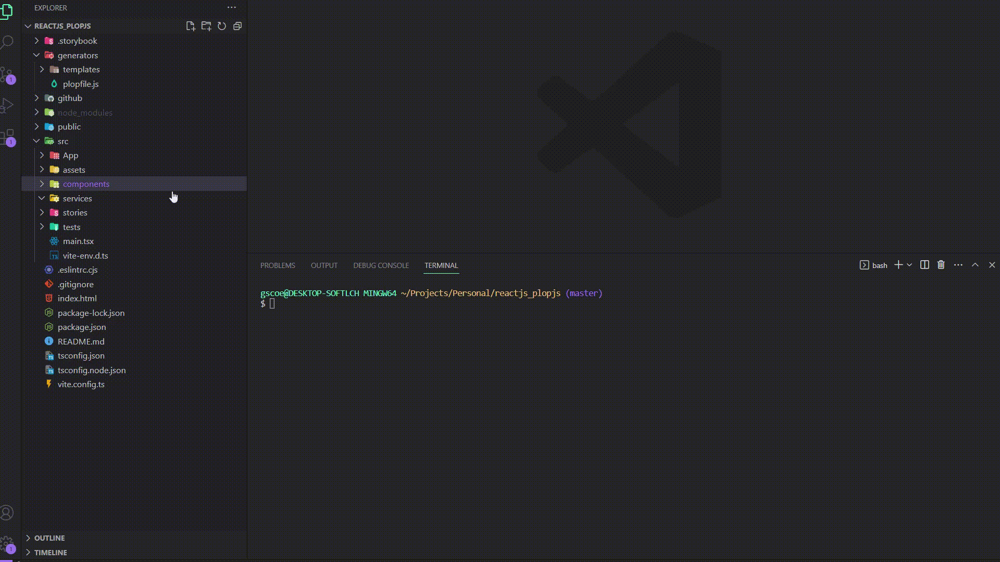

<div align='center'>

  <h1>Frontend - React JS template</h1>

  <br />
  <p>This project was created in order to speed up the development of web interfaces with custom templates for my routine as a developer</p>

[](/docs/ "Go to project documentation")

</div>

<div align='center'>

[](https://)
[](https://)
[](https://)
[](https://)

<br />

  <div align='center'>
    
  </div>

</div>

## Summary

- [How to run this project](#project)
- [How does this template work??](#work)
- [What templates does this project provide?](#templates)

<br />

<div>
  <h3 id='project'>How to run this project on your machine</h3>
  <br/>
  <p>
    Make sure you have installed node js on your machine, after that just download it and run the following command:
  </p>
<br/>

```
npm install && npm run generate
```

<br />
</div>

<div>
  <h3 id='work'>How does this template work??</h3>
  <br/>

  <p>This project use <a href='https://plopjs.com/' target='_blank'>Plop js</a> library, using handlebars to create template, checkout the website to get more details. The configuration file are in the generator folder:

```
~/generators/plopfile.js

export default function (plop) {
  plop.setGenerator("create-component", {
    description: "Create react component with tests and storybook",
    prompts: [
      {
        type: "input",
        name: "component",
        message: "Component name:",
      }
    ],
    actions: [
      {
        type: "add",
        path: "../{{path}}/{{pascalCase component}}/index.tsx",
        templateFile: "./templates/createComponent/component.tsx.hbs",
      },
    ],
  }),
```

<br />

<p>Basically we have this sintax to get our template, all prompts set new values to use into our template.hbs files, while actions create files based on our config.</p>

```
~/generators/templates/createComponent/component.tsx.hbs

import { FC } from 'react';
import * as S from './style';

interface I{{ pascalCase component}} {};

export const {{ pascalCase component}}:FC<I{{ pascalCase component}}> = () => {
  return (
    <S.Container>
      <h1>{{ component }}</h1>
    </S.Container>
  )
}

```

<p>See that the variable sitting in the plopfile.js component file is being used between {{ }} to call the var</p>
<br />
</div>

<div>
  <div align='center'>
    <h3 id='templates'>What templates does this project provide?</h3>
    
  </div>

- `create-component`: provides a react jsx template with typescript and styled-components boilerplate. Add storybook file and create a basic test with vitest and react testing-library.
- `react-query/useQuery`: provides a file to get a request with react-query library and typescript.
- `react-query/useMutation`: provides a file to make a `POST/PUT/DELETE/PATCH` request with react-query library and typescript.
- `react-query/useInfiniteQuery`: provides a file to make a `GET` request but using pagination or infinite scroll request.
</div>
